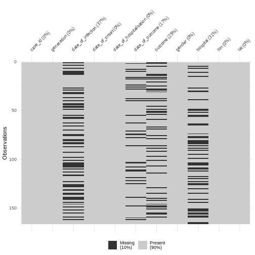

:::::::::::::::::::::::::::::::::::::: questions 

- How to calculate delays from line list data?
- Why it is important to account for delays in outbreak analytics?

::::::::::::::::::::::::::::::::::::::::::::::::

::::::::::::::::::::::::::::::::::::: objectives

- Use the pipe operator `%>%` to structure sequences of data operations.
- Count observations in each group using `count()` function.
- Create new columns from existing columns using `mutate()` function.
- Keep or drop columns by their names using `select()`.
- Keep rows that match a condition using `filter()`.
- Create graphics declaratively using `{ggplot2}`.

::::::::::::::::::::::::::::::::::::::::::::::::

:::::::::: instructor

Useful concepts maps to teach this episode are

- <https://github.com/rstudio/concept-maps?tab=readme-ov-file#dplyr>
- <https://github.com/rstudio/concept-maps?tab=readme-ov-file#pipe-operator>

::::::::::

:::::::::: prereq

**Setup an RStudio project and folder**

- Create an RStudio project. If needed, follow this [how-to guide on "Hello RStudio Projects"](https://docs.posit.co/ide/user/ide/get-started/#hello-rstudio-projects) to create one.
- Inside the RStudio project, create the `data/` folder.
- Inside the `data/` folder, save the [linelist.csv](https://epiverse-trace.github.io/tutorials/data/linelist.csv) file.

::::::::::

::::::::::::::: checklist

**RStudio projects**

The directory of an RStudio Project named, for example `training`, should look like this:

```
training/
|__ data/
|__ training.Rproj
```

**RStudio Projects** allows you to use _relative file_ paths with respect to the `R` Project, 
making your code more portable and less error-prone. 
Avoids using `setwd()` with _absolute paths_ 
like `"C:/Users/MyName/WeirdPath/training/data/file.csv"`.

:::::::::::::::

::::::::::::::: challenge

Let's starts by creating `New Quarto Document`!

1. In the RStudio IDE, go to: File > New File > Quarto Document
2. Accept the default options
3. Save the file with the name `01-report.qmd`
4. Use the `Render` button to render the file and preview the output.

<!-- - Keep using **Quarto**. Follow their Get Started tutorial: <https://quarto.org/docs/get-started/hello/rstudio.html> -->

<!-- https://journals.plos.org/ploscompbiol/article?id=10.1371/journal.pcbi.1012018 -->

:::::::::::::::

## Introduction

A new Ebola Virus Disease (EVD) outbreak has been notified in a country in West Africa. The Ministry of Health is coordinating the outbreak response and has contracted you as a consultant in epidemic analysis to inform the response in real-time. The available report of cases is coming from hospital admissions.

Let's start by loading the package `{readr}` to read `.csv` data, `{dplyr}` to manipulate data, `{tidyr}` to rearrange it, and `{here}` to write file paths within your RStudio project. We'll use the pipe `%>%` to connect some of their functions, including others from the package `{ggplot2}`, so let's call to the package `{tidyverse}` that loads them all:


``` r
# Load packages
library(tidyverse) # loads readr, dplyr, tidyr and ggplot2
```

``` output
── Attaching core tidyverse packages ──────────────────────── tidyverse 2.0.0 ──
✔ dplyr     1.1.4     ✔ readr     2.1.5
✔ forcats   1.0.0     ✔ stringr   1.5.1
✔ ggplot2   3.5.1     ✔ tibble    3.2.1
✔ lubridate 1.9.3     ✔ tidyr     1.3.1
✔ purrr     1.0.2     
── Conflicts ────────────────────────────────────────── tidyverse_conflicts() ──
✖ dplyr::filter() masks stats::filter()
✖ dplyr::lag()    masks stats::lag()
ℹ Use the conflicted package (<http://conflicted.r-lib.org/>) to force all conflicts to become errors
```

::::::::::::::::::: checklist

**The double-colon**

The double-colon `::` in R let you call a specific function from a package without loading the entire package into the current environment. 

For example, `dplyr::filter(data, condition)` uses `filter()` from the `{dplyr}` package.

This helps us remember package functions and avoid namespace conflicts.

:::::::::::::::::::

## Explore data

For the purpose of this episode, we will read a pre-cleaned line list data. Following episodes will tackle how to solve cleaning tasks.


``` r
# Read data
# e.g.: if path to file is data/linelist.csv then:
cases <- readr::read_csv(
  here::here("data", "linelist.csv")
)
```


:::::::::::::::::::: checklist

**Why should we use the {here} package?**

The package `{here}` simplifies file referencing in R projects. It allows them to work across different operating systems (Windows, Mac, Linux). This feature, called **cross-environment compatibility**,  eliminates the need to adjust file paths. For example:

- On Windows, paths are written using backslashes ( `\` ) as the separator between folder names: `"data\raw-data\file.csv"` 
- On Unix based operating system such as macOS or Linux the forward slash ( `/` ) is used as the path separator: `"data/raw-data/file.csv"`

The `{here}` package adds one more layer of reproducibility to your work. For more, read this tutorial about [open, sustainable, and reproducible epidemic analysis with R](https://epiverse-trace.github.io/research-compendium/)

::::::::::::::::::::


``` r
# Print line list data
cases
```

``` output
# A tibble: 166 × 11
   case_id generation date_of_infection date_of_onset date_of_hospitalisation
   <chr>        <dbl> <date>            <date>        <date>                 
 1 d1fafd           0 NA                2014-04-07    2014-04-17             
 2 53371b           1 2014-04-09        2014-04-15    2014-04-20             
 3 f5c3d8           1 2014-04-18        2014-04-21    2014-04-25             
 4 e66fa4           2 NA                2014-04-21    2014-05-06             
 5 49731d           0 2014-03-19        2014-04-25    2014-05-02             
 6 0f58c4           2 2014-04-22        2014-04-26    2014-04-29             
 7 6c286a           2 NA                2014-04-27    2014-04-27             
 8 881bd4           3 2014-04-26        2014-05-01    2014-05-05             
 9 d58402           2 2014-04-23        2014-05-01    2014-05-10             
10 f9149b           3 NA                2014-05-03    2014-05-04             
# ℹ 156 more rows
# ℹ 6 more variables: date_of_outcome <date>, outcome <chr>, gender <chr>,
#   hospital <chr>, lon <dbl>, lat <dbl>
```

:::::::::::::: discussion

Take a moment to review the data and its structure..

- Do the data and format resemble line lists you’ve encountered before?
- If you were part of the outbreak investigation team, what additional information might you want to collect?

::::::::::::::

:::::::::::: instructor

The information to collect will depend on the questions we need to give a response.

At the beginning of an outbreak, we need data to give a response to questions like:

- How fast does an epidemic grow?
- What is the risk of death?
- How many cases can I expect in the coming days?

Informative indicators are:

- growth rate, reproduction number.
- case fatality risk, hospitalization fatality risk.
- projection or forecast of cases.

Useful data are:

- date of onset, date of death.
- delays from infection to onset, from onset to death.
- percentage of observations detected by surveillance system.
- subject characteristics to stratify the analysis by person, place, time.

::::::::::::

You may notice that there are **missing** entries.

::::::::::::: spoiler

We can also explore missing data with summary a visualization:


``` r
cases %>%
  visdat::vis_miss()
```



:::::::::::::

:::::::::::: discussion

Why do we have more missings on date of infection or date of outcome?

::::::::::::

::::::::::::: instructor

- date of infection: mostly unknown, depended on limited coverage of contact tracing or outbreak research, and sensitive to recall bias from subjects.
- date of outcome: reporting delay

:::::::::::::


## Calculate severity

A frequent indicator for measuring severity is the Case Fatality Risk (CFR). 

CFR is defined as the conditional probability of death given confirmed diagnosis, calculated as the cumulative number of deaths from an infectious disease over the number of confirmed diagnosed cases.

We can use the function `dplyr::count()` to count the observations in each group of the variable `outcome`:


``` r
cases %>%
  dplyr::count(outcome)
```

``` output
# A tibble: 3 × 2
  outcome     n
  <chr>   <int>
1 Death      65
2 Recover    59
3 <NA>       42
```

:::::::::::: discussion

Report:

- What to do with cases whose outcome is `<NA>`?

- Should we consider missing outcomes to calculate the CFR?

::::::::::::

:::::::::::: instructor

Keeping cases with missing outcome is useful to track the incidence of number of new cases, useful to assess transmission.

However, when assessing severity, CFR estimation is sensitive to:

- **Right-censoring bias**. If we include observations with unknown final status we can underestimate the true CFR.

- **Selection bias**. At the beginning of an outbreak, given that health systems collect most clinically severe cases, an early estimate of the CFR can overestimate the true CFR. 

::::::::::::

Data of today will not include outcomes from patients that are still hospitalised. Then, one relevant question to ask is: In average, how much time it would take to know the outcomes of hospitalised cases? For this we can calculate **delays**!

## Calculate delays

The time between sequence of dated events can vary between subjects. For example, we would expect the date of infection to always be before the date of symptom onset, and the later always before the date of hospitalization.

In a random sample of 30 observations from the `cases` data frame we observe variability between the date of hospitalization and date of outcome: 


We can calculate the average time from hospitalisation to outcome from the line list.

From the `cases` object we will use:

- `dplyr::select()` to keep columns using their names,
- `dplyr::mutate()` to create one new column `outcome_delay` as a function of existing variables `date_of_outcome` and `date_of_hospitalisation`,
- `dplyr::filter()` to keep the rows that match a condition like `outcome_delay > 0`,
- `skimr::skim()` to get useful summary statistics


``` r
# delay from report to outcome
cases %>%
  dplyr::select(case_id, date_of_hospitalisation, date_of_outcome) %>%
  dplyr::mutate(outcome_delay = date_of_outcome - date_of_hospitalisation) %>%
  dplyr::filter(outcome_delay > 0) %>%
  skimr::skim(outcome_delay)
```


Table: Data summary

|                         |           |
|:------------------------|:----------|
|Name                     |Piped data |
|Number of rows           |123        |
|Number of columns        |4          |
|_______________________  |           |
|Column type frequency:   |           |
|difftime                 |1          |
|________________________ |           |
|Group variables          |None       |


**Variable type: difftime**

|skim_variable | n_missing| complete_rate|min    |max     |median | n_unique|
|:-------------|---------:|-------------:|:------|:-------|:------|--------:|
|outcome_delay |         0|             1|1 days |55 days |7 days |       29|

::::::::::::::::: callout

**Inconsistencies among sequence of dated-events?**

Wait! Is it consistent to have negative time delays from primary to secondary observations, i.e., from hospitalisation to death?

In the next episode called **Clean data** we will learn how to check sequence of dated-events and other frequent and challenging inconsistencies!

:::::::::::::::::

::::::::::::::::: challenge

To calculate a _delay-adjusted_ Case Fatality Risk (CFR), we need to assume a known delay from onset to death.

Using the `cases` object:

- Calculate the summary statistics of the delay from onset to death.

::::::::::::: hint

Keep the rows that match a condition like `outcome == "Death"`:


``` r
# delay from onset to death
cases %>%
  dplyr::filter(outcome == "Death") %>%
  ...() # replace ... with downstream code
```

Is it consistent to have negative delays from onset of symptoms to death?

:::::::::::::

::::::::::::: solution


``` r
# delay from onset to death
cases %>%
  dplyr::select(case_id, date_of_onset, date_of_outcome, outcome) %>%
  dplyr::filter(outcome == "Death") %>%
  dplyr::mutate(delay_onset_death = date_of_outcome - date_of_onset) %>%
  dplyr::filter(delay_onset_death > 0) %>%
  skimr::skim(delay_onset_death)
```


Table: Data summary

|                         |           |
|:------------------------|:----------|
|Name                     |Piped data |
|Number of rows           |46         |
|Number of columns        |5          |
|_______________________  |           |
|Column type frequency:   |           |
|difftime                 |1          |
|________________________ |           |
|Group variables          |None       |


**Variable type: difftime**

|skim_variable     | n_missing| complete_rate|min    |max     |median | n_unique|
|:-----------------|---------:|-------------:|:------|:-------|:------|--------:|
|delay_onset_death |         0|             1|2 days |17 days |7 days |       15|

Where is the source of the inconsistency? Let's say you want to keep the rows with negative delay values to investigate them. How would you do it?

:::::::::::::

:::::::::::: solution

We can use `dplyr::filter()` again to identify the inconsistent observations:


``` r
# keep negative delays
cases %>%
  dplyr::select(case_id, date_of_onset, date_of_outcome, outcome) %>%
  dplyr::filter(outcome == "Death") %>%
  dplyr::mutate(delay_onset_death = date_of_outcome - date_of_onset) %>%
  dplyr::filter(delay_onset_death < 0)
```

``` output
# A tibble: 6 × 5
  case_id date_of_onset date_of_outcome outcome delay_onset_death
  <chr>   <date>        <date>          <chr>   <drtn>           
1 c43190  2014-05-06    2014-04-26      Death   -10 days         
2 bd8c0e  2014-05-17    2014-05-09      Death    -8 days         
3 49d786  2014-05-20    2014-05-11      Death    -9 days         
4 e85785  2014-06-03    2014-06-02      Death    -1 days         
5 60f0c2  2014-06-07    2014-05-30      Death    -8 days         
6 a48f5d  2014-06-15    2014-06-10      Death    -5 days         
```

More on estimating a _delay-adjusted_ Case Fatality Risk (CFR) on the episode about **Estimating outbreak severity**!

::::::::::::

:::::::::::::::::


## Epidemic curve

The first question we want to know is simply: how bad is it? The first step of the analysis is descriptive. We want to draw an epidemic curve or epicurve. This visualises the incidence over time by date of symptom onset.

From the `cases` object we will use:

- `ggplot()` to declare the input data frame,
- `aes()` for the variable `date_of_onset` to map to `geoms`,
- `geom_histogram()` to visualise the distribution of a single continuous variable with a `binwidth` equal to 7 days.


``` r
# incidence curve
cases %>%
  ggplot(aes(x = date_of_onset)) +
  geom_histogram(binwidth = 7)
```


:::::::::::: discussion

The early phase of an outbreak usually growths exponentially.

- Why exponential growth may not be observed in the most recent weeks?

::::::::::::

::::::::::: instructor

Close inspection of the line list shows that the last date of any entry (by date of hospitalization) is a bit later than the last date of symptom onset.

From the `cases` object we can use:

- `dplyr::summarise()` to summarise each group down to one row,
- `base::max` to calculate the maximum dates of onset and hospitalisation.

When showcasing this to learners in a live coding session, you can also use `cases %>% view()` to rearrange by date columns.


``` r
cases %>%
  dplyr::summarise(
    max_onset = max(date_of_onset),
    max_hospital = max(date_of_hospitalisation)
  )
```

``` output
# A tibble: 1 × 2
  max_onset  max_hospital
  <date>     <date>      
1 2014-06-27 2014-07-07  
```

:::::::::::

You may want to examine how long after onset of symptoms cases are hospitalised; this may inform the **reporting delay** from this line list data:


``` r
# reporting delay
cases %>%
  dplyr::select(case_id, date_of_onset, date_of_hospitalisation) %>%
  dplyr::mutate(reporting_delay = date_of_hospitalisation - date_of_onset) %>%
  ggplot(aes(x = reporting_delay)) +
  geom_histogram(binwidth = 1)
```


The distribution of the reporting delay in day units is heavily skewed. Symptomatic cases may take up to **two weeks** to be reported.

From reports (hospitalisations) in the most recent two weeks, we completed the exponential growth trend of incidence cases within the last four weeks:


Given to reporting delays during this outbreak, it seemed that two weeks ago we had a decay of cases during the last three weeks. We needed to wait a couple of weeks to complete the incidence of cases on each week.

:::::::::::::: challenge

Report:

- What indicator can we use to estimate transmission from the incidence curve?

::::::::: solution

- The growth rate! by fitting a linear model.
- The reproduction number accounting for delays from secondary observations to infection.

More on this topic on episodes about **Aggregate and visualize** and **Quantifying transmission**.


``` output
# A tibble: 2 × 6
  count_variable term        estimate std.error statistic  p.value
  <chr>          <chr>          <dbl>     <dbl>     <dbl>    <dbl>
1 date_of_onset  (Intercept) -537.      70.1        -7.67 1.76e-14
2 date_of_onset  date_index     0.233    0.0302      7.71 1.29e-14
```

Note: Due to the diagnosed reporting delay, We conveniently truncated the epidemic curve one week before to fit the model! This improves the fitted model to data when quantifying the growth rate during the exponential phase.

:::::::::

::::::::::::::

In order to account for these _epidemiological delays_ when estimating indicators of severity or transmission, in our analysis we need to input delays as **Probability Distributions**. We will learn how to fit and access them in the next episodes.  

## Challenges

:::::::::::::::::::::::: challenge

<!-- summative assessment -->

**Relevant delays when estimating transmission**

- Review the definition of the [incubation period](reference.md#incubation) in our glossary page.

- Calculate the summary statistics of the incubation period distribution observed in the line list.

- Visualize the distribution of the incubation period from the line list.

::::::::::::: solution

Calculate the summary statistics:


``` r
cases %>%
  dplyr::select(case_id, date_of_infection, date_of_onset) %>%
  dplyr::mutate(incubation_period = date_of_onset - date_of_infection) %>%
  skimr::skim(incubation_period)
```


Table: Data summary

|                         |           |
|:------------------------|:----------|
|Name                     |Piped data |
|Number of rows           |166        |
|Number of columns        |4          |
|_______________________  |           |
|Column type frequency:   |           |
|difftime                 |1          |
|________________________ |           |
|Group variables          |None       |


**Variable type: difftime**

|skim_variable     | n_missing| complete_rate|min    |max     |median | n_unique|
|:-----------------|---------:|-------------:|:------|:-------|:------|--------:|
|incubation_period |        61|          0.63|1 days |37 days |5 days |       25|

Visualize the distribution:


``` r
cases %>%
  dplyr::select(case_id, date_of_infection, date_of_onset) %>%
  dplyr::mutate(incubation_period = date_of_onset - date_of_infection) %>%
  ggplot(aes(x = incubation_period)) +
  geom_histogram(binwidth = 1)
```


In coming episode we will learn how to fit statistical _distribution paramaters_ to a distribution, or access to the most appropriate estimates.

With the distribution parameters of the incubation period we can infer the length of active monitoring or quarantine. 
[Lauer et al., 2020](https://pubmed.ncbi.nlm.nih.gov/32150748/) estimated the incubation period of Coronavirus Disease 2019 (COVID-19) from publicly reported confirmed cases.

:::::::::::::

::::::::::::::::::::::::::


::::::::::::::::::::::::::::::::::::: keypoints 

- Use packages from the `tidyverse` like `{dplyr}`, `{tidyr}`, and `{ggplot2}` for exploratory data analysis.
- Epidemiological delays condition the estimation of indicators for severity or transmission.

::::::::::::::::::::::::::::::::::::::::::::::::

### References

- Cori, A. et al. (2019) Real-time outbreak analysis: Ebola as a case study - part 1 · Recon Learn, RECON learn. Available at: https://www.reconlearn.org/post/real-time-response-1 (Accessed: 06 November 2024).

- Cori, A. et al. (2019) Real-time outbreak analysis: Ebola as a case study - part 2 · Recon Learn, RECON learn. Available at: https://www.reconlearn.org/post/real-time-response-2 (Accessed: 07 November 2024).
